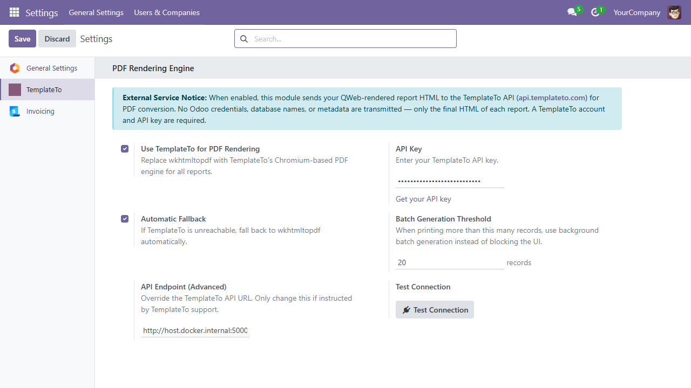
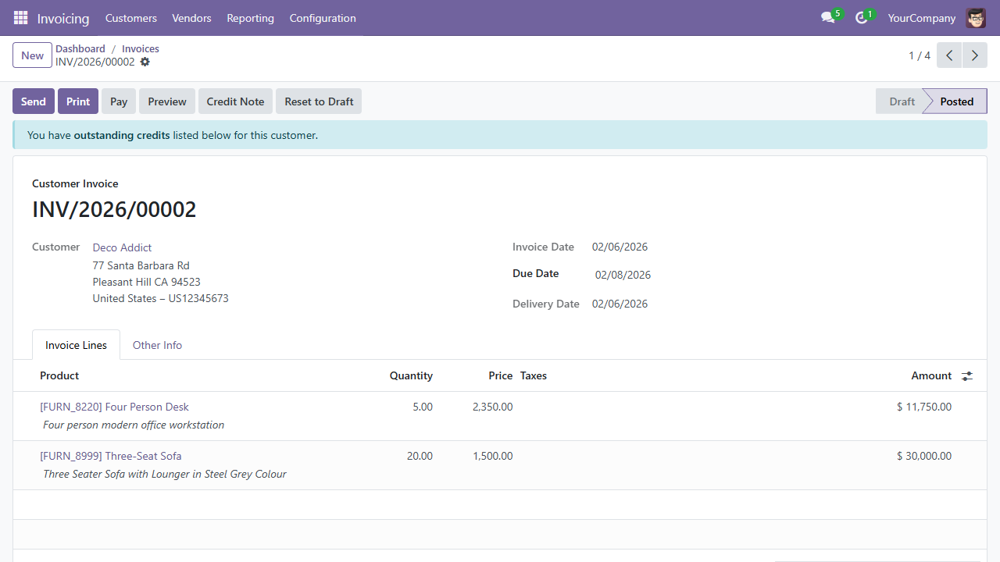
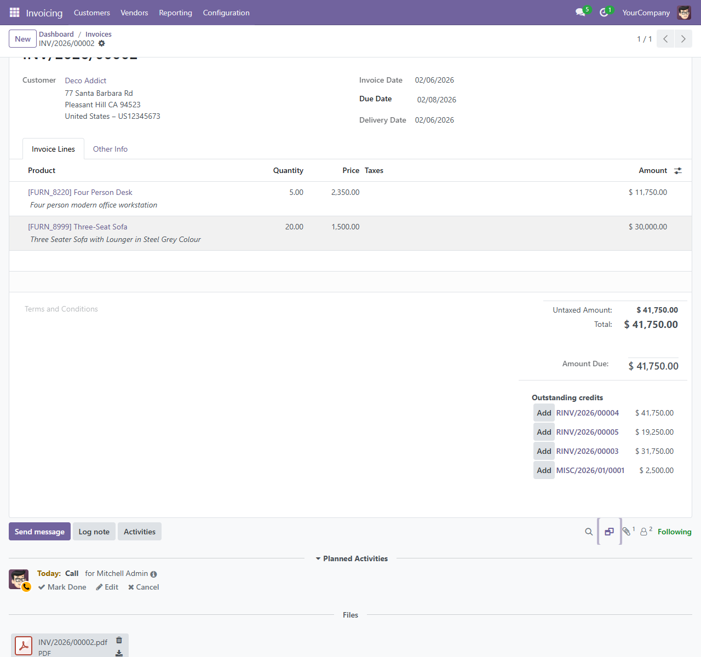
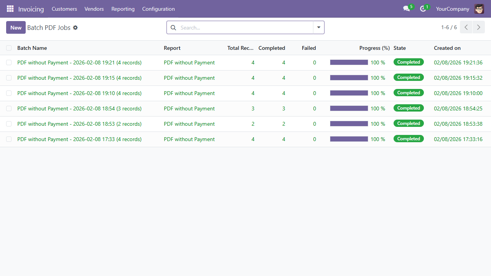

# Odoo

TemplateTo is a hosted document-rendering service powered by Chromium, the browser engine behind Google Chrome. The **TemplateTo Reports** addon connects Odoo 18 or 19 to that service, replacing wkhtmltopdf without requiring you to rebuild your existing QWeb report templates.

!!! important "Free addon, paid TemplateTo service"
    The TemplateTo Reports addon is free and open source. PDF rendering is provided by the separate TemplateTo hosted service and requires an active paid TemplateTo plan. TemplateTo usage is billed separately and is not included with the addon.

    [View TemplateTo pricing](https://templateto.com/#pricing){ .md-button } [Create an account](https://app.templateto.com/auth/signup){ .md-button }

## Overview

Odoo still renders each QWeb template to HTML. The addon sends that final HTML to the TemplateTo API, TemplateTo renders it with Chromium, and the completed PDF is returned to Odoo. This gives you:

- **Modern CSS support** — flexbox, grid, media queries, custom fonts, gradients
- **Reliable rendering** — no more blank PDFs, broken headers/footers, or timeout crashes
- **Sync + batch generation** — interactive Print for small batches, background processing for bulk operations
- **Automatic fallback** — if the API is unreachable, Odoo falls back to wkhtmltopdf seamlessly

### Requirements and Supported Versions

- Odoo 18.0 or 19.0 Community or Enterprise
- Odoo.sh or a self-hosted Odoo installation
- A TemplateTo account with an active paid plan and an API key
- Internet connectivity from the Odoo server to `https://api.templateto.com`

## Installation

### From the Odoo Apps Store

Download the free addon version that matches your Odoo installation:

- [TemplateTo Reports for Odoo 18](https://apps.odoo.com/apps/modules/18.0/report_templateto)
- [TemplateTo Reports for Odoo 19](https://apps.odoo.com/apps/modules/19.0/report_templateto)

The addon supports Odoo.sh and self-hosted installations. It is not available for Odoo Online, which does not support installing this type of third-party Python addon.

1. Open the marketplace listing for your Odoo version
2. Click **Download** and follow Odoo's prompts to install it
3. Alternatively, open **Apps** in Odoo, search for **"TemplateTo"**, and click **Install**
4. [Create a TemplateTo account](https://app.templateto.com/auth/signup), select a paid plan, and [generate an API key](https://app.templateto.com/generate/api-keys)

### Manual Installation

1. Clone the branch that matches your Odoo major version. For Odoo 19:
   ```bash
   git clone --branch 19.0 --single-branch https://github.com/TemplateTo/TemplateTo.Odoo.git
   cp -r TemplateTo.Odoo/report_templateto /opt/odoo/addons/
   ```
   Use `--branch 18.0` for Odoo 18.
2. Restart Odoo
3. Go to **Settings → Technical → Update Apps List**
4. Search for "TemplateTo" in the Apps list and click **Install**

## Configuration

Once installed, configure the module in Odoo Settings:

1. Go to **Settings → TemplateTo** (under the Technical section)
2. Enable **"Use TemplateTo for PDF Rendering"**
3. Enter your **API key**
4. Click **Test Connection** to verify the key works
5. Click **Save**



!!! tip
    Don't have an API key yet? [Create a TemplateTo account](https://app.templateto.com/auth/signup), select a paid plan, and then [generate an API key](https://app.templateto.com/generate/api-keys). See the [API keys documentation](../../account/api-keys.md) for details.

### Settings Reference

| Setting | Default | Description |
|---------|---------|-------------|
| Enable TemplateTo | Off | Global toggle — when off, Odoo uses wkhtmltopdf as normal |
| API Key | — | API key from your paid TemplateTo account |
| API Endpoint | `https://api.templateto.com` | Only change if directed by TemplateTo support |
| Fallback to wkhtmltopdf | On | Automatically use wkhtmltopdf if the TemplateTo API is unreachable |
| Batch threshold | 20 | Number of records above which batch generation is used instead of sync |

## Printing a Single Report

Once the module is enabled, printing works exactly as before — but PDFs are now rendered by Chrome headless instead of wkhtmltopdf.

1. Open any record (e.g. an invoice, sale order, purchase order)
2. Click **Print** and select the report (e.g. "Invoices")
3. The PDF downloads as usual



Behind the scenes:

1. Odoo renders the QWeb template to HTML (unchanged)
2. The module sends the HTML to the TemplateTo API
3. TemplateTo renders it with Chromium and returns PDF bytes
4. The PDF is returned to Odoo as if wkhtmltopdf had generated it

For small batches (up to 20 records by default), the module sends parallel API requests for fast results.

## Batch PDF Generation

When you need to generate PDFs for many records at once — month-end invoices, bulk statements, mass mailings — the module uses background processing to avoid browser timeouts.

### How to Run a Batch Job

1. Go to a list view (e.g. **Invoicing → Invoices**)
2. Select the records you want (use the checkboxes)
3. Click **Actions → Generate PDFs via TemplateTo**
4. The batch wizard opens — confirm and start the job

### What Happens Next

- A background job is created and processed by Odoo's scheduled actions
- Each record's report HTML is sent to the TemplateTo async API
- Progress is tracked and visible in the batch job view
- When complete, you receive a notification with a link to download all PDFs
- Each generated PDF is attached to its source record — you'll find it in the **Files** section of the record's chatter



### Viewing Batch Jobs

!!! note
    The batch jobs menu is under **Settings → Technical**, which is only visible when [developer mode](https://www.odoo.com/documentation/19.0/applications/general/developer_mode.html) is enabled. Activate it via **Settings → Developer Tools → Activate the developer mode**.

Go to **Settings → Technical → TemplateTo Batch Jobs** to see all batch jobs, their progress, and download completed results.



## Fallback Behaviour

When **"Fallback to wkhtmltopdf"** is enabled (the default):

- If the TemplateTo API returns an error or is unreachable, the module silently falls back to wkhtmltopdf
- The PDF is generated as if the module weren't installed
- A warning is logged in the Odoo server log for debugging

When fallback is **disabled**:

- API failures raise an error to the user
- This is useful if you want to ensure all PDFs are rendered by Chromium and be alerted to any issues

## Data & Privacy

The module sends **only rendered report HTML** to the TemplateTo API. This is the same HTML that wkhtmltopdf would receive — no Odoo credentials, database names, user data, or metadata are transmitted.

How your data is handled depends on the rendering mode:

- **Sync rendering** (Print button, small batches) — your HTML is processed in [volatile memory](https://templateto.com/security) only, meaning it exists temporarily in the server's working memory and is never saved to disk. The data is discarded as soon as the PDF is returned.
- **Async rendering** (background batch jobs) — the resulting PDF is stored temporarily in encrypted S3 storage for up to **24 hours** so your Odoo server can retrieve it. After 24 hours, the file is automatically deleted. The source HTML is still processed in volatile memory only and is never persisted to disk.

For full details, see the [TemplateTo Security page](https://templateto.com/security).

The module is disabled by default and requires explicit opt-in before any data is sent.

## Troubleshooting

### "Connection Test Failed"

- Verify your API key is correct — copy it fresh from the [TemplateTo API Keys page](https://app.templateto.com/generate/api-keys)
- Check that your Odoo server can reach `https://api.templateto.com` (firewall/proxy rules)
- If using a custom endpoint, verify the URL is correct

### PDFs Look the Same as Before

- Make sure the module is **enabled** in Settings → TemplateTo
- Check the Odoo server log for TemplateTo-related messages
- If fallback is enabled, the module may be silently falling back to wkhtmltopdf due to an API issue

### Batch Job Stuck at 0%

- Verify that Odoo's scheduled actions (cron jobs) are running
- Check the Odoo server log for errors in the `report_templateto` module
- Ensure your API key has sufficient quota for the number of records

### Timeout on Large Reports

- For very large reports, the sync API has a timeout. The module automatically uses batch mode for record counts above the configured threshold (default: 20)
- You can lower the batch threshold in settings if needed

### General Debugging

Enable Odoo's debug mode and check the server log for lines containing `templateto`. The module logs API requests, responses, and any fallback events.
