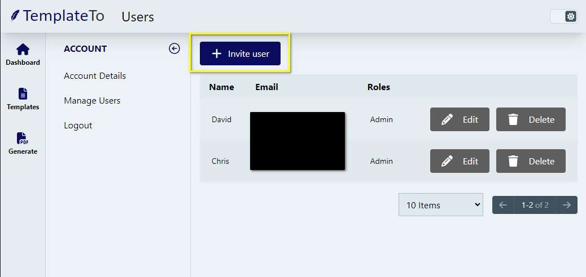
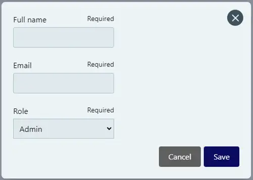

# Adding Users

You can add additional users to your account, you can either add these users as Admins or Editors. 

Admins can take any action within your account.
Editors can only make edits to templates, they can can view users and API Keys, but they can not remove or add them. 

To add a user to your account, navigate to the users screen: https://app.templateto.com/account/users 

Click on the + add user button.

The following pop-up will be shown:

  

Fill out the details and click Save, the user will now receive an email inviting them to join your company. 