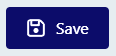

# Editor overview

The TemplateTo editor is powerful, but also simple to use. To achieve this some of the more advanced features are slightly obscured, however if you want to use them they are still easily available. 

In this overview we will look at a lot of the features on offer within TemplateTo.

## The full editor window
  

## Top bar

The top bar has a number of buttons within it, lets go over what each one does. 
  

From left to right:

| Item                     |                                                                                              | Description                                                                                                   |
| ------------------------ | -------------------------------------------------------------------------------------------- | ------------------------------------------------------------------------------------------------------------- |
| TemplateTo Logo          | {: .off-glb } |                                                                                                               |
| Template name            | { .off-glb } | The name of the template currently being edited                                                               |
| Generation type selector | { .off-glb } | Used by the Preview button, it indicates if the preview should be in txt or pdf.                              |
| Preview button           | { .off-glb } | Opens a preview of the current template, opens in another tab. Will automatically update when you save changes |
| Template Settings button | { .off-glb } | Opens a window with several settings, things like Margins, headers/footers, template name.                    |
| Save button              | { .off-glb } | Saves changes to the template                                                                                 |
| Generate button          | { .off-glb } | Takes you to the generation page, this allows you to create a generated template from within the UI.          |
|                          |                                                                                              |                                                                                                               |

## Editor function menu

The editor function menu gives you access to Properties, Elements, Data and CSS as well as allowing you to undo/redo actions, import and export your templates.

| Item          |                                                                                               | Description                                                                                                                                                            |
| ------------- | --------------------------------------------------------------------------------------------- | ---------------------------------------------------------------------------------------------------------------------------------------------------------------------- |
| Undo          | { .off-glb }  | Will undo the last action made within the editor window                                                                                                                |
| Redo          | { .off-glb } | Will redo an undone action                                                                                                                                             |
| Outline       | { .off-glb } | Toggles the grey dotted lines on an off within the editor window                                                                                                       |
| Import/Export | { .off-glb } | Opens a dialogue so you can import a template or export the current template                                                                                           |
| Elements      | { .off-glb } | Will Show the available components in the right hand panel of the editor                                                                                               |
| Properties    | { .off-glb } | Opens the Properties and settings panel for the selected element, allows you to add element styling                                                                    |
| Data          | { .off-glb } | Opens the data panel, this allows you to add variables to the editor, these can be added to your template and teh value can be used to test your templates output.     |
| CSS           | { .off-glb } | Opens the CSS panel so yu can make changes to the template. This is an advanced feature, most user wont need to change css directly, the properties panel can be used. |
|               |                                                                                               |                                                                                                                                                                        |

## Editor window

This is an example of an editor window with a few Elements added.

  

| Item | Description                                                                                                                                                                                                                                                                                     |
| ---- | ----------------------------------------------------------------------------------------------------------------------------------------------------------------------------------------------------------------------------------------------------------------------------------------------- |
| 1    | This is the text editor bar, this becomes active when you are working with text or heading elements. You can select text within the element and style is with these options. If you want to apply a style to the whole element you might be better off using the properties window to do that. |
| 2    | The blue border indicates which element you currently have selected within the editor.                                                                                                                                                                                                          |
| 3    | This is the element toolbar, each element has at least a remove and move option, some elements have additional options as well.                                                                                                                                                                 |
| 4    | This dotted line represents the outline, it is active by default but can be turned off using the Outlines toggle in the Editor function bar.                                                                                                                                                    |
| 5    | This line shows an estimate of the end of a pages content. Content beyond this line will appear on a new page, you can use the badge (where the text is displayed) to move the line to adjust the end of a page based on preview. This is help give a visual indication, if you need to define the end of a page use the Page Break element. |

## Template settings window

To open the template settings click on the __Template Settings__ button. 

{ .off-glb } 

Within the window there are a few options available to you. 

  

| Item | Description                                                                                                                                                                                                                                                           |
| ---- | --------------------------------------------------------------------------------------------------------------------------------------------------------------------------------------------------------------------------------------------------------------------- |
| 1    | Edit the template name.                                                                                                                                                                                                                                              |
| 2    | Enable HTML editing, this gives lots of flexibility, but it does come with risks, so proceed at your own risk.                                                                                                                                                        |
| 3    | Enabling data logging will make TemplateTo persist lots of information about template generations, you can see exactly what data is being passed in and you can see data about the request, this is very useful when integrating, however it should be off once live. |
| 4    | Select the page size you desire, this will change the editor window to match your selection.                                                                                                                                                                          |
| 5    | You can add a Headers and Footers to your template, we achieve this by linking contentblocks with your template. when you turn this option on you can provide the contentblocks you want to use.                                                                      |
| 6.   | This allows you to configure the margins for your template.                                                                                                                                                                                                           |
|      |                                                                                                                                                                                                                                                                       |
