# Elements

TemplateTo comes with a number of elements designed to speed up the creation of templates.

Elements fall into 4 categories. 

| Item     | Description                                                                                                                      |
| -------- | -------------------------------------------------------------------------------------------------------------------------------- |
| Layout   | These elements allow you to more easily compose complex document layouts                                                         |
| Basic    | These elements include Text, Image and header elements, these are easy to work with and usually content focused                  |
| Advanced | Use advanced elements if you are comfortable with custom code                                                                    |
| Logic    | Logic components allow you to show or hide sections of your template based on data based to your template at point of generation |
|          |                                                                                                                                  |

## Layout elements

  

| Item            | Description                                                                        |
| --------------- | ---------------------------------------------------------------------------------- |
| 1 Column        | This provides a single column layout                                               |
| 2 Column, 50/50 | Two columns initial set to 50% width each. Adjust the width with the anchor points |
| 3 Column        | A Three column layout with each column set to 33% width. Widths also adjustable    |
| 2 Column, 20/80 | Another two column layout, this time with an 20/80 split. Widths also adjustable   |
|                 |                                                                                    |

!!! tip
    You can nest layouts within one another.

### Video: Working with layouts
<iframe width="560" height="315" src="https://www.youtube.com/embed/mLaeH9AtGHk?si=sc8KRI_GDCUJGfU8" title="YouTube video player" frameborder="0" allow="accelerometer; autoplay; clipboard-write; encrypted-media; gyroscope; picture-in-picture; web-share" allowfullscreen></iframe>

## Basic elements

  

| Item                                                       | Description                                            |
| ---------------------------------------------------------- | ------------------------------------------------------ |
| [Text](/getting-started/elements/#text)                    | Simple WYSIWYG text element                            |
| [Image](/getting-started/elements/#image)                  | Add images to your template                            |
| [Content Block](/getting-started/elements/#content-blocks) | Content blocks are reusable content. See more details. |
| [Page Break](/getting-started/elements/#page-break)        | Add a Page Break to your template                      |
| [Header](/getting-started/elements/#header)                | Simply adds a heading section                          |
| [Table](/getting-started/elements/#table)                  | Add a table to the editor                              |
|                                                            |                                                        |

### Text

This element puts a WYSIWYG editor onto your template, you can style the text within the element using the tools in the [Editor window](/getting-started/editor-overview/#editor-window)

### Image

Add images to your template with this element. Either drag images into the upload area of navigate to your image.


### Content Blocks

Content Blocks are reusable content that can be used in multiple templates.

!!! info
    These are like mini-templates. You can use a lot of the same components we are discussing here within the content block

    Go to the [Content Block area of the admin](https://app.templateto.com/templates/blocks) to create Content Blocks.

### Page Break

As you would expect in word or any other text editing software, this breaks the content that comes after onto a new page.

  

1. A Page Break element fills the remaining space on the page. As you change content above the size of the Page Break element will adjust so you can see how much space is left.
2. This text will be on the next page (page 2 in this example).

### Header

The header element adds a heading to the template, you can use the custom header menu to change the heading.

  

1. Custom Header editor bar.

### Table

The table element, as you might expect, allows you to add a table to your template. 

#### Table settings

Table elements have settings you can change from the properties panel:
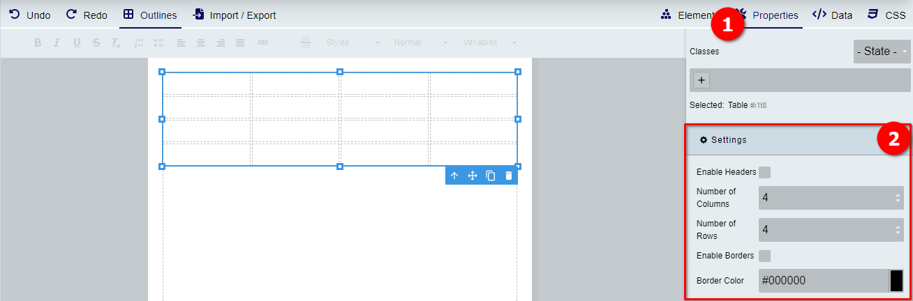

#### Table row options

!!! tip "Selecting a row"
    The simplest way to select the table row is to click on a cell within the row you want to select the handle on the left hand side of the row.

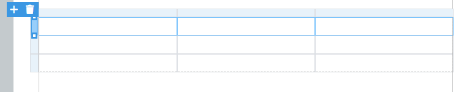  


Click on the + and you get the following options:

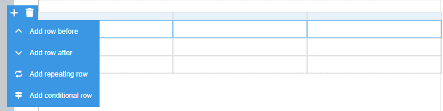  

If you select an options which requires additional settings. The relevant popup will appear. Configure the row as required. 

If you need to change the settings, select the row again by the handle and click on the cog symbol. 

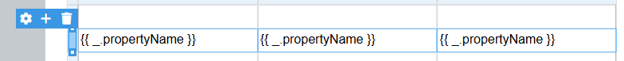  

##### Repeating rows

The repeating row options allows you to repeat a row for each item in an array. The syntax is as follows 

```{{_.propertyName}}```

The `_` represents the array being iterated. You can access the properties if you have any with the `.propertyName` notation. If you are working with an array of strings or numbers you can just use `_` to print the items. 

##### Conditional rows

If you have a table that requires hiding rows in a given situation you can make use of the conditional rows option. As you might expect, it will hide the row if the set condition is met. 

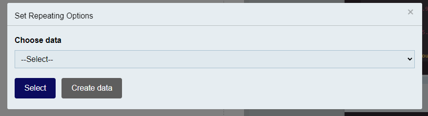  

??? example
    ``` js
    {
        "invoiceNumber": "123456",
        "date": "2024-01-07",
        "billingAddress": {
            "name": "John Doe",
            "street": "123 Apple St",
            "city": "New York",
            "state": "NY",
            "zip": "10001"
        },
        "shippingAddress": {
            "name": "John Doe",
            "street": "123 Apple St",
            "city": "New York",
            "state": "NY",
            "zip": "10001"
        },
        "lineItems": [
            {
            "item": "Laptop",
            "description": "15-inch, 1TB SSD, 16GB RAM",
            "quantity": 1,
            "unitPrice": 1200.00,
            "total": 1200.00
            },
            {
            "item": "Wireless Mouse",
            "description": "Bluetooth, Ergonomic Design",
            "quantity": 2,
            "unitPrice": 35.50,
            "total": 71.00
            },
            {
            "item": "USB-C Adapter",
            "description": "4K HDMI, USB 3.0, Ethernet",
            "quantity": 1,
            "unitPrice": 45.99,
            "total": 45.99
            }
        ],
        "subTotal": 1316.99,
        "tax": 118.53,
        "shippingCost": 15.00,
        "total": 1450.52,
        "notes": "Thank you for your business!"
    }
    ```

I can add the data to the row using an underscore followed by the property name as it appears in the JSON. 

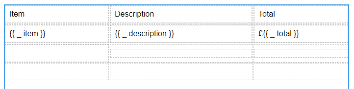  

In this example we have added the item, description and total properties from the array to the repeating row. When this is rendered with the example data above it results in the following

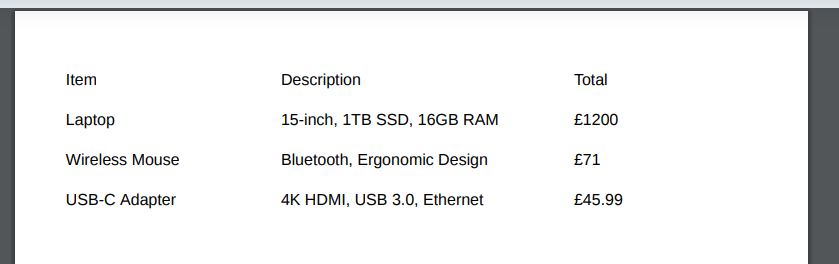


#### Table cell options

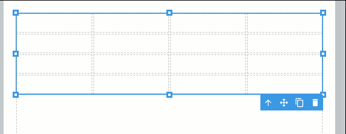 

The video shows how to work with some of the table cell option to add column and rows as well as merging and unmerging cells. 

##### Cell column menu

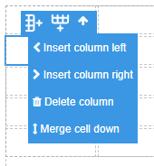  

##### Cell row menu

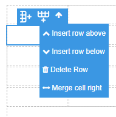  

#### Merging and un-merging cells

To merge cells use the appropriate option from the cell menus above. 

To un-merge cells, click on the a merged cell, there is an additional option on the cell toolbar now, it looks like four blocks *(see below)*. 

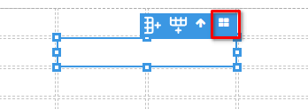  


## Advanced elements

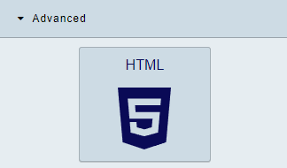  

### HTML

To add some custom HTML to your template simply click or drag this element into the editor. Double click to open, you can add your html within the editor window. 

!!! warning
    If script tags are entered the custom html wont be saved. 
    We currently don't support running script tags within a template.

## Logic

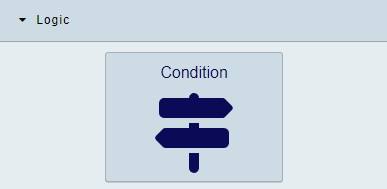  

### Condition

!!! note
    It might be helpful to have data added to your template when working with the Condition element. [Learn more here](/getting-started/working-with-variables)

The condition element allows you to show a section only when specified conditions are met. 

The following conditions are available:

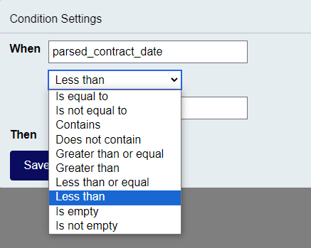  

The following clip shows how to work with the condition element. 


!!! note
    You can put any content you want within a condition element. Which makes them very powerful.