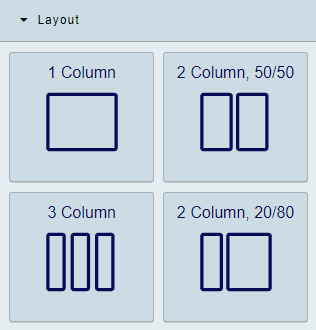
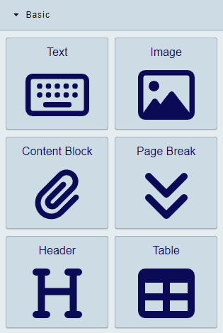
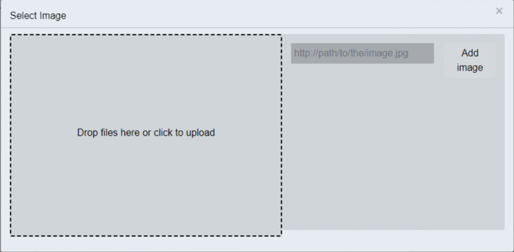
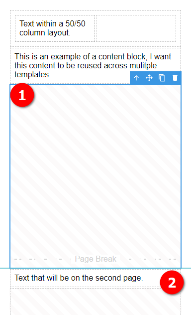
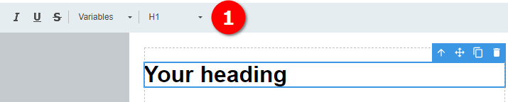

# Elements

TemplateTo comes with a number of elements designed to speed up the creation of templates.

Elements fall into 4 categories. 

| Item     | Description                                                                                                                      |
| -------- | -------------------------------------------------------------------------------------------------------------------------------- |
| Layout   | These elements allow you to more easily compose complex document layouts                                                         |
| Basic    | These elements include Text, Image and header elements, these are easy to work with and usually content focused                  |
| Advanced | Use advanced elements if you are comfortable with custom code                                                                    |
| Logic    | Logic components allow you to show or hide sections of your template based on data based to your template at point of generation |
|          |                                                                                                                                  |

## Layout elements

  

| Item            | Description                                                                        |
| --------------- | ---------------------------------------------------------------------------------- |
| 1 Column        | This provides a single column layout                                               |
| 2 Column, 50/50 | Two columns initial set to 50% width each. Adjust the width with the anchor points |
| 3 Column        | A Three column layout with each column set to 33% width. Widths also adjustable    |
| 2 Column, 20/80 | Another two column layout, this time with an 20/80 split. Widths also adjustable   |
|                 |                                                                                    |

!!! tip
    You can nest layouts within one another.

### Video: Working with layouts
<iframe width="560" height="315" src="https://www.youtube.com/embed/mLaeH9AtGHk?si=sc8KRI_GDCUJGfU8" title="YouTube video player" frameborder="0" allow="accelerometer; autoplay; clipboard-write; encrypted-media; gyroscope; picture-in-picture; web-share" allowfullscreen></iframe>

## Basic elements

  

| Item                                                       | Description                                            |
| ---------------------------------------------------------- | ------------------------------------------------------ |
| [Text](/getting-started/elements/#text)                    | Simple WYSIWYG text element                            |
| Image                                                      | Add images to your template                            |
| [Content Block](/getting-started/elements/#content-blocks) | Content blocks are reusable content. See more details. |
| Page Break                                                 | Add a Page Break to your template                      |
| Header                                                     | Simply adds a heading section                          |
| Table                                                      | Add a table to the editor                              |
|                                                            |                                                        |

### Text

This element puts a WYSIWYG editor onto your template, you can style the text within the element using the tools in the [Editor window](/getting-started/editor-overview/#editor-window)

### Image

Add images to your template with this element. Either drag images into the upload area of navigate to your image.

### Content Blocks

Content Blocks are reusable content that can be used in multiple templates.

!!! info
    These are like mini-templates. You can use a lot of the same components we are discussing here within the content block

    Go to the [Content Block area of the admin](https://app.templateto.com/templates/blocks) to create Content Blocks.

### Page Break

As you would expect in word or any other text editing software, this breaks the content that comes after onto a new page.

  

1. A Page Break element fills the remaining space on the page. As you change content above the size of the Page Break element will adjust so you can see how much space is left.
2. This text will be on the next page (page 2 in this example).

### Header

The header element adds a heading to the template, you can use the custom header menu to change the heading.

  

1. Custom Header editor bar.

### Table

The table element, as you might expect, allows you to add a table to your template. 

