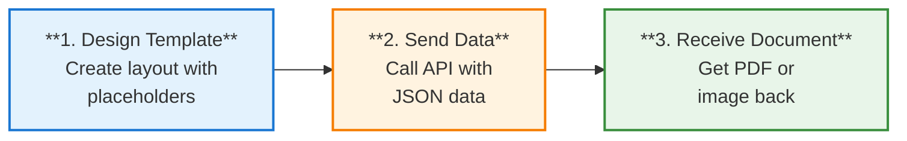

# How Templates Work

This guide explains the core concepts behind TemplateTo and how the template rendering workflow operates.

## What is a Template?

A template is a reusable document design that combines a fixed layout with dynamic data. When you render a template, TemplateTo replaces variables with your data to produce a personalized document.

Templates can output:

- **PDF documents** - Invoices, contracts, reports, certificates
- **Images (PNG/JPEG)** - Social media graphics, thumbnails, Open Graph images
- **Plain text (TXT)** - Email content, data exports, simple text documents

## The Rendering Workflow



1. **Design your template** in the visual editor with placeholders for dynamic content
2. **Call the API** with your data (JSON format)
3. **Receive the generated document** (PDF or image) in the response

### Example

**Template with variable:**
```
Hello {{customerName}}, your order total is {{total}}.
```

**API request data:**
```json
{
  "customerName": "Acme Corp",
  "total": "$150.00"
}
```

**Generated output:**
```
Hello Acme Corp, your order total is $150.00.
```

## Key Concepts

### Elements

Elements are the building blocks of your template. TemplateTo provides:

- **Layout elements** - Columns, containers for organizing content
- **Basic elements** - Text, images, tables, headers, page breaks
- **Advanced elements** - Custom HTML for complex layouts
- **Logic elements** - Conditional content based on your data

### Variables

Variables are placeholders that get replaced with real data at render time. Use double curly braces: `{{variableName}}`

Variables can be:

- Simple values: `{{customerName}}`
- Nested objects: `{{customer.address.city}}`
- Array items in loops: `{{item.description}}`

### Themes

Themes let you share CSS styling across multiple templates. Define colors, fonts, and spacing once, then apply to any template.

### Liquid Templating

TemplateTo uses [Liquid](https://shopify.github.io/liquid/) for advanced templating features:

- **Filters** - Transform data: `{{ price | format_number: "C" }}`
- **Conditionals** - Show/hide content: `...`
- **Loops** - Repeat for arrays: `...`

## Output Formats

### PDF Documents

Best for:

- Printable documents (invoices, contracts)
- Multi-page content
- Documents requiring headers, footers, and page numbers
- Password-protected files

### Images (PNG/JPEG)

Best for:

- Social media graphics
- Email headers and thumbnails
- Open Graph images for link previews
- Anywhere you need web-displayable content

PNG supports transparency, JPEG offers smaller file sizes.

### Plain Text (TXT)

Best for:

- Email body content
- Data exports and reports
- SMS or notification content
- Any scenario where you need text without formatting

## Integration Options

### REST API

For developers who want full control. Make HTTP requests to render documents programmatically.

```bash
curl -X POST "https://api.templateto.com/render/pdf/your-template-id" \
  -H "X-Api-Key: your-api-key" \
  -H "Content-Type: application/json" \
  -d '{"customerName": "Acme Corp"}'
```

### No-Code Platforms

Connect TemplateTo with Zapier or N8N to automate document generation without writing code.

## What's Next?

- [Build your first template](../template-guide/creating/first-template.md) - Step-by-step tutorial
- [Learn about variables](../template-guide/dynamic-content/variables.md) - Use dynamic data in templates
- [REST API Reference](../developer-guide/rest-api.md) - Full API documentation
