# Template settings

TemplateTo gives you a lot of control over your templates. Allowing you to configure many aspects.

  

Click the settings button to open the template settings panel.

## General settings
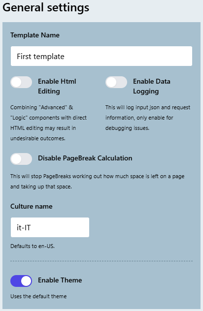

In General settings you can change the templates name, Enable Html editing and Enable data logging. 

Changing the template name is obvious, however the other two options might be less so, so lets go into more details.

### Enable HTML Editing

If you enable this option then your editor will have another option next to the css option where you can change the HTML of the template. 

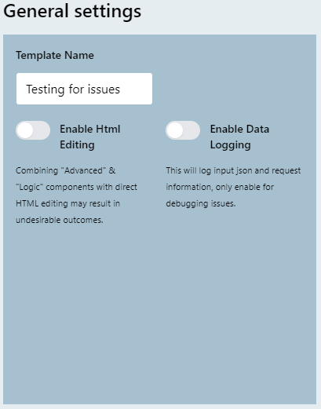  
!!! warning
    Combining "Advanced" & "Logic" components with direct HTML editing may result in undesirable outcomes.
    
    If you want to work with the HTML directly, you may be better served to work exclusively with the HTML editor.

### Enable Data Logging

When you are integrating with a template for the first time it can be hard to understand why your output isnt what you expect, in our experience this is often due to input data not matching your expected format, so to help debug these types of issues we added this option. When this is enabled you will get additional information. 

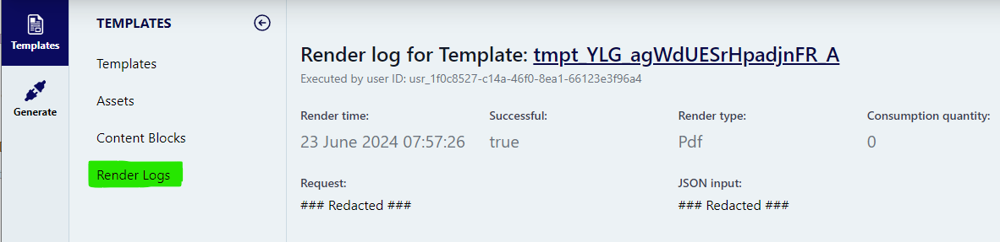  
This is what is logged when the setting is disable, in this case we dont store any of the data sent to use for document generation. The data only lives in memory and is forgotten when the request is complete. 

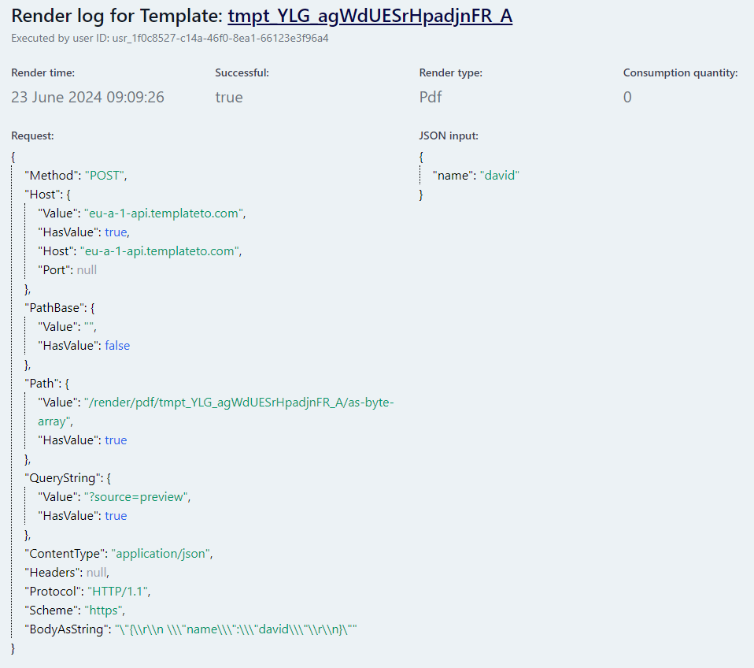  
In this example we have enabled the data logging. As you can see we now store the request and data input. 

!!! note
    Consumption quantity in these examples is 0 as the generations were triggered via the editors preview function. 

!!! warning
    Due to data being saved it is recommended that once you have finished debugging you disable this option.

### Disable PageBreak Calculation

When this setting is off the application calculates where you can expect page breaks to fall when you print your document. 

If you don't want this behaviour then you can disable it for the template. 

This can be useful in some scenarios. As this calculation isn't perfect. 

### Culture name

If you want your template to render in a culture other than `en-US` you can provide the culture code here. When you use date and number formatting the culture name given here will be used.

### Enable Theme

This will apply the theme file marked as default to the template. This will take affect both in the template editor and in the generated template.

[Theme documentation](../template-themes)

## PDF Settings

Numerous settings you can apply to your PDF. 

### Paper size

Change the size of your page to suit your needs.

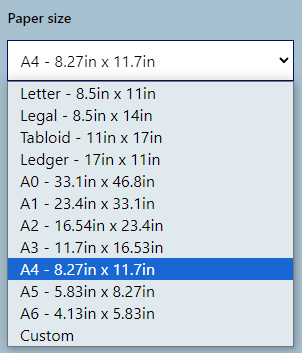  

If you want a custom size, select "custom" and you will then be given two fields to enter the custom size you want. 

!!! note
    The custom size should be provided in mm (millimeters).

### Orientation

As you would expect, this changes the documents orientation, if enabled the document will be landscape.

### Print background

Enable to print background graphics. This is enabled by default.

### Display Header / Footer

Enable if you want to have a header and footer on your documents pages. 
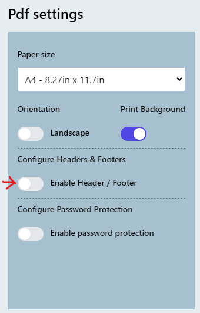  

You can select a content block for each the header or the footer. 

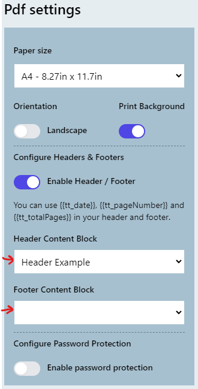  

### PDF Password protection

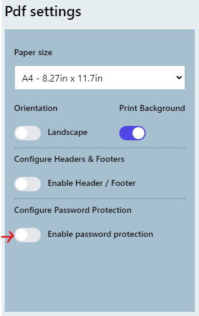  

Once you enable password protection for your pdf, you will get the following options:
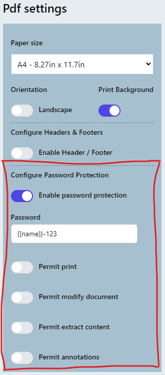  

### Other options

| Field                  | Description                                                                                                                  |
| ---------------------- | ---------------------------------------------------------------------------------------------------------------------------- |
| Password               | The password field accepts plain text as well as **variables** from your template, this includes **variables created with filters**. |
| Permit Print           | Permits printing of the document                                                                                             |
| Permit modify document | Permits modifying the contents of the document by operations other than those controlled by PermitAnnotations                |
| Permit extract content | Permits copying or extracting text and graphics from the document.                                                           |
| Permit annotations     | Permits adding or modifying text annotations                                                                                 |
|                        |                                                                                                                              |

## Margins  

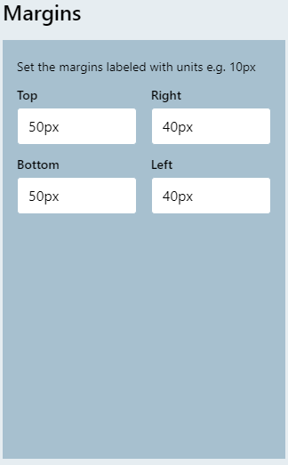  

Set the required margins for you documents. 

!!! note
    Your headers and footers get rendered in the margins, so ensure to take that into account when setting this up.

## Cover page

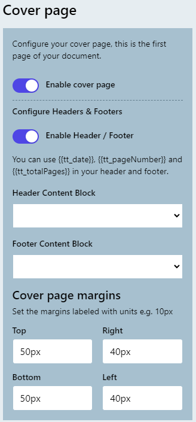  

The cover page options are a repeat of some of the options that you can set on the rest of the template. However these settings are only applied to the first page of you document. 
