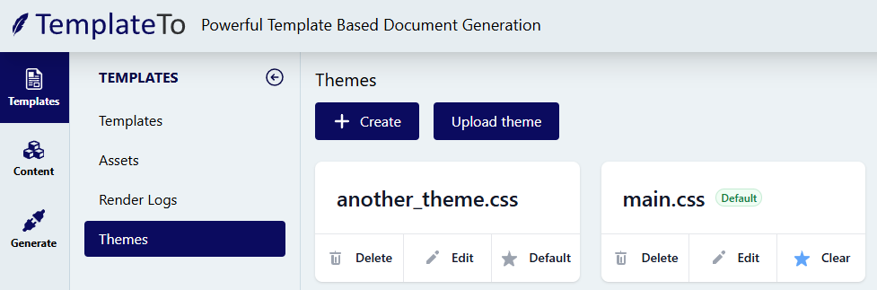
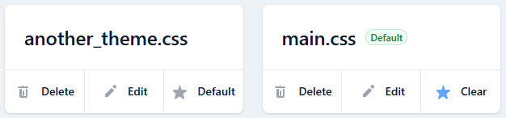

# Template Themes

Themes allow you to share styling with all your templates and content blocks, reducing duplication and simplifying your template management.

  

Themes can be found in the Template sub menu. As shown above. 

You can either Create a theme from scratch or upload a css file. 

  
When you create or upload a new theme, it will get a card. The card has three buttons. 

| Button                  | Description                                                                                                                  |
| ---------------------- | ---------------------------------------------------------------------------------------------------------------------------- |
| Delete | Permanently remove the theme |
| Edit | Takes you to the theme editor, this is an in browser css editor. |
| Default or Clear | When you enable themes for a template. It will be the default theme that is applied. |

!!! note
    Although only being able to apply the default theme gives some limitation, this is a beta feature so there are some limitations while we gather feedback from customers. 

## How themes work

On templates you want to apply your default theme to, go to [template settings](../template-settings/#enable-theme) and enable themes. This will update the editor and apply the theme during generation.

When a theme is applied to a template, it will be applied to all components within that template during generations.

When editing a content block, you will need to go to the settings and toggle "Load theme" so the editor loads the same theme and the template.