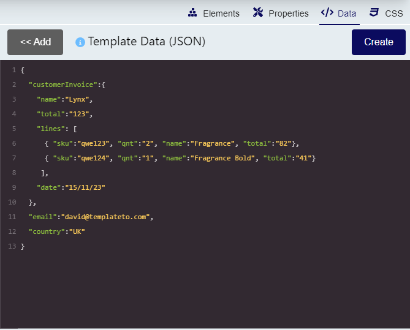
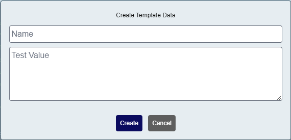
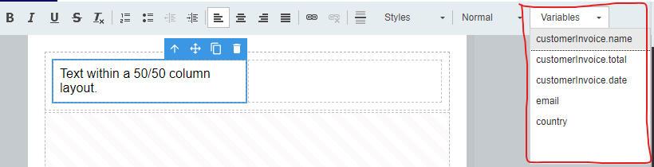
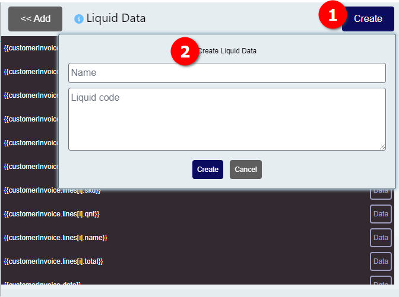

# Working with variables

To allow you to create templates with your own data, TemplateTo has variables. Variables are passed to us along with a render request (either via an integration or via our Rest API).

This data is expected in a JSON format. You can have any structure you like though. 

To make building templates easier we have added some tools for working with data inside TemplateTo.

## Adding data to a template

In the UI can add data to test your template with, to do this just paste or type your expected JSON into the Template Data window. 


??? example
    ``` js
    {
      "customerInvoice":{
        "name":"Lynx",
        "total":"123",
        "lines": [
          { "sku":"qwe123", "qnt":"2", "name":"Fragrance", "total":"82"},
          { "sku":"qwe124", "qnt":"1", "name":"Fragrance Bold", "total":"41"}
        ],
        "date":"15/11/23"
      },
      "email":"david@templateto.com",
      "country":"UK"
    }
    ```

If you are not comfortable adding JSON and expect your data to form a simple key/value pair structure, you can make use of the Create button. 


Using this will add the input to the JSON window in valid JSON format for you. 

### Using data within a template

Now you have some data, you can use it within your template. You can add a variable to you template just by typing {{variable_name}} or you can use the variable dropdown within the editor and select the variable you want from there.

  

## Liquid variables

TemplateTo makes use of the Liquid engine for working with variables. You can read more about this in the [documentation here](https://shopify.github.io/liquid/basics/introduction). In the rest of this page we will go over some examples and cover the extensions we have added. 

### Create a liquid variable

Navigate to the Data tab within the [editors function menu](/getting-started/editor-overview/#editor-function-menu), from there:

  

You can give your variable a name and then create your liquid filter in the liquid code section. 

!!! warning
    The order of liquid variables is important if one is used by another, the one being used needs to be defined first.

## TemplateTo Liquid filters

We have created a few additional filters in addition to the filters available in the [official liquid documentation](https://shopify.github.io/liquid/basics/introduction).

### parse_date

parse_date is a filter that allows you take a string input and parse it to a valid date. Once you have done that you can use the built in date filter to format the date as you wish. 

An example of parse_date based on the example JSON above:

!!! quote ""

    ``` yaml title="parse date"
    customerInvoice.date | parse_date | date: "%e %B %Y" # (1)!
    ```

    Result: 15 November 2023

    1.  Helpful tool to help create your [date format string.](https://strftime.net/)

