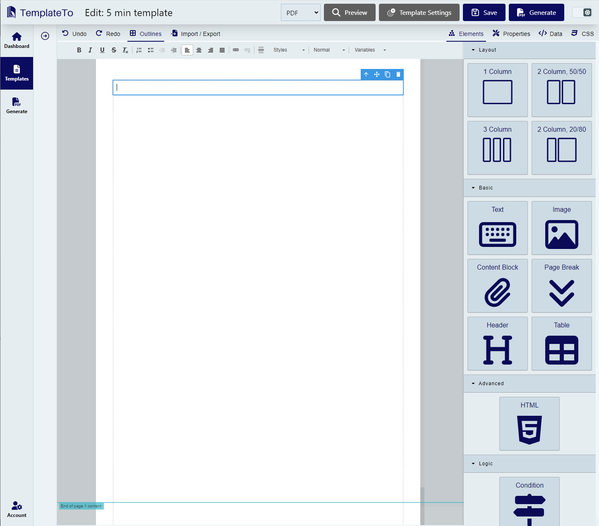

# Introduction

TemplateTo offers a rich web-based PDF template builder that lets you design flexible documents. The template editor includes powerful components that allow you huge flexability in design, allowing you to create documents that match you needs.

You can automate your PDF document generation via our REST APIs or via our integrations with Zapier and N8N.

- :material-rocket-launch:{ .lg .middle } **Quick Start**

    ---

    Get up and running with TemplateTo in 5 minutes

    [:octicons-arrow-right-24: 5-Minute Tutorial](getting-started/getting-started-in-5-mins.md)

- :material-pencil-ruler:{ .lg .middle } **Editor Guide**

    ---

    Learn how to use the template editor

    [:octicons-arrow-right-24: Editor Overview](getting-started/editor-overview.md)

- :material-api:{ .lg .middle } **API Integration**

    ---

    Automate document generation via REST API

    [:octicons-arrow-right-24: Integrations](integrations/index.md)

- :material-clock-fast:{ .lg .middle } **Async Rendering**

    ---

    Generate documents in the background

    [:octicons-arrow-right-24: Async API](integrations/async-rendering.md)

The TemplateTo Template Editor:

