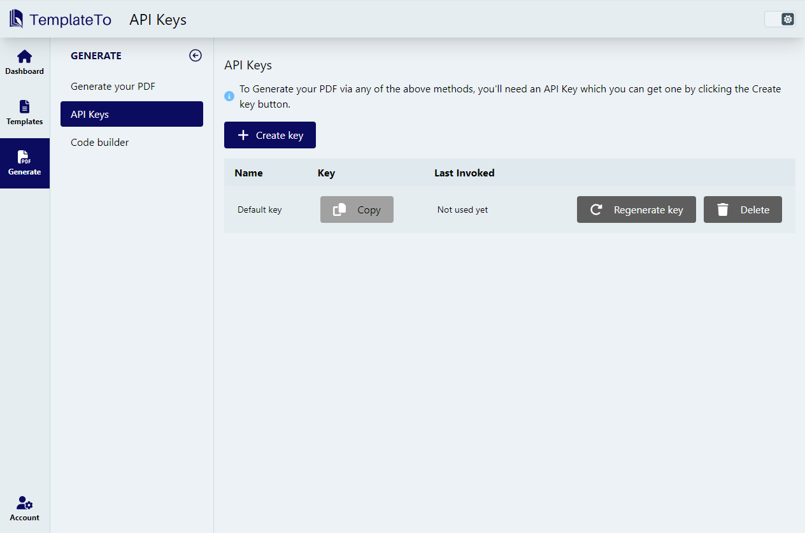

# Introduction

TemplateTo offers a rich web-based PDF template builder that lets you design flexible documents. The template editor includes powerful components that allow you huge flexability in design, allowing you to create documents that match you needs.

You can automate your PDF document generation via our REST APIs or via our integrations with Zapier and N8N.

## Authentication

For all integrations you will need to authenticate with TemplateTo. We support API keys which you can [manage from the app](https://app.templateto.com/generate/api-keys). 

API Key management page:
  
