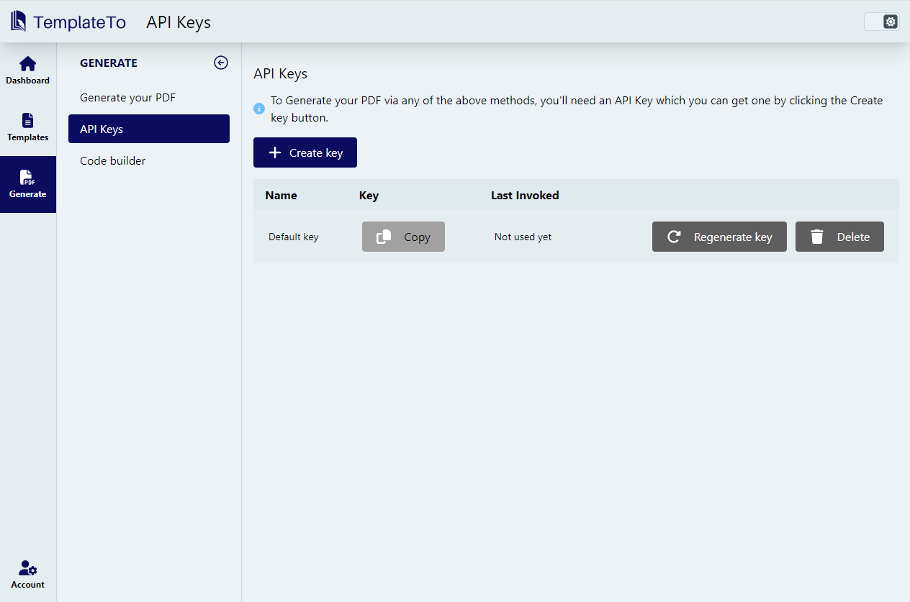

# Integrations Overview

TemplateTo provides powerful automation capabilities to generate PDFs and images (PNG/JPEG) programmatically. Whether you're building a custom application or using no-code tools, we have the right integration for you.

## Available Integrations

### [REST API](restAPI.md)
Build custom integrations with our comprehensive REST API. Perfect for developers who want full control over the document and image generation process. Supports PDF, PNG, and JPEG output formats.

**Use cases:**
- Generate invoices from your billing system
- Create reports from your database
- Bulk generate certificates or documents
- Generate social media images and graphics
- Create Open Graph images for web pages
- Integrate with any programming language

### [Zapier](zapier.md)
Connect TemplateTo with 5,000+ apps without writing code. Create automated workflows that generate PDFs based on triggers from your favorite tools.

**Popular workflows:**
- Generate invoices when new orders arrive
- Create contracts from form submissions
- Send personalized PDFs via email
- Archive documents to cloud storage

### [N8N](n8n.md)
Build complex automation workflows with this powerful open-source platform. N8N provides advanced features for data transformation and conditional logic.

**Key features:**
- Self-hosted option for maximum control
- Visual workflow builder
- Advanced data manipulation
- Error handling and retries

## Authentication

All integrations require authentication using API keys. This ensures your templates and data remain secure.

### Managing API Keys

1. Go to the [API Keys page](https://app.templateto.com/generate/api-keys) in your TemplateTo account
2. Click **"Create New API Key"**
3. Give your key a descriptive name (e.g., "Production Server" or "Zapier Integration")
4. Copy the key immediately - it won't be shown again
5. Store it securely in your application's environment variables

!!! warning "Security Best Practices"
    - Never commit API keys to version control
    - Use different keys for development and production
    - Rotate keys regularly
    - Delete unused keys immediately

## Getting Started

1. **Choose your integration method** based on your technical requirements
2. **Create an API key** for authentication
3. **Follow the specific guide** for your chosen integration
4. **Test with sample data** before going to production

Need help choosing? Here's a quick guide:
- **Developers**: Use the REST API for maximum flexibility
- **No-code users**: Start with Zapier for easy setup
- **Power users**: Consider N8N for complex workflows  
