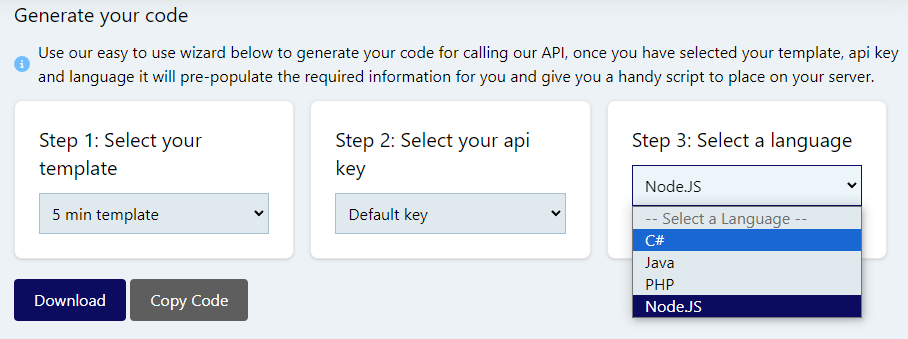

# REST API

The REST API allows you to generate documents synchronously, returning the document directly in the response. This is ideal for simple integrations where you need the document immediately.

## Overview

- **Synchronous** - Document is returned directly in the response
- **Formats** - PDF, PNG, JPEG, and TXT supported
- **Response types** - File download or Base64 encoded string

!!! tip "For Large Documents"
    For large documents or high-volume generation, consider using the [Async Rendering API](async-rendering.md) which processes documents in the background.

## Authentication

All endpoints require an API key. Pass your API key in the `X-Api-Key` header.

See [API Key Management](../getting-started/api-key-management.md) for details on creating API keys.

## Base URL

```
https://api.templateto.com/render
```

## Endpoints

### Generate PDF

Generate a PDF document from a template.

```
POST /render/pdf/{templateId}
```

#### Path Parameters

| Parameter | Type | Description |
|-----------|------|-------------|
| `templateId` | string | Your template ID |

#### Request Body

Pass your template data as JSON:

```json
{
  "customerName": "Acme Corp",
  "invoiceNumber": "INV-2024-001",
  "items": [
    { "description": "Widget", "quantity": 5, "price": 10.00 },
    { "description": "Gadget", "quantity": 2, "price": 25.00 }
  ]
}
```

#### Response

Returns the PDF file directly with `Content-Type: application/pdf`.

---

### Generate PDF (Base64)

Returns the PDF as a Base64 encoded string instead of a file download.

```
POST /render/pdf/{templateId}/as-byte-array
```

#### Response

Returns a Base64 encoded string representing the PDF.

---

### Generate TXT

Generate a plain text document from a template.

```
POST /render/txt/{templateId}
```

#### Path Parameters

| Parameter | Type | Description |
|-----------|------|-------------|
| `templateId` | string | Your template ID |

#### Request Body

Same JSON format as PDF generation.

#### Response

Returns the TXT file directly with `Content-Type: text/plain`.

---

### Generate PDF from Raw HTML

Generate a PDF from raw HTML content without using a template.

```
POST /render/pdf/fromhtml
```

#### Request Body

```json
{
  "base64HtmlString": "PGh0bWw+PGJvZHk+SGVsbG8gV29ybGQ8L2JvZHk+PC9odG1sPg=="
}
```

!!! tip "Base64 Encoding"
    The HTML content must be Base64 encoded. In JavaScript: `btoa(htmlString)`. In Python: `base64.b64encode(html_string.encode()).decode()`.

#### Response

Returns the PDF file directly.

---

### Generate Image

Generate a PNG or JPEG image from a template. Useful for social media previews, thumbnails, and visual content.

```
POST /render/image/{templateId}
```

#### Path Parameters

| Parameter | Type | Description |
|-----------|------|-------------|
| `templateId` | string | Your template ID |

#### Query Parameters

| Parameter | Type | Default | Description |
|-----------|------|---------|-------------|
| `format` | string | `png` | Output format: `png` or `jpeg` |
| `width` | integer | *derived* | Image width in pixels (derived from template page size if not specified) |
| `height` | integer | *auto* | Image height in pixels (only used when `fullpage=false`) |
| `quality` | integer | `90` | JPEG quality (0-100). Only applies to JPEG format |
| `fullpage` | boolean | `true` | Capture full scrollable page height |
| `scale` | float | `1` | Device scale factor. Use `2` for retina/high-DPI output |
| `clipX` | integer | - | X coordinate of clip region (pixels from left) |
| `clipY` | integer | - | Y coordinate of clip region (pixels from top) |
| `clipWidth` | integer | - | Width of clip region in pixels |
| `clipHeight` | integer | - | Height of clip region in pixels |
| `circular` | boolean | `false` | Apply circular mask to clip (forces PNG output) |

#### Request Body

Pass your template data as JSON:

```json
{
  "customerName": "Acme Corp",
  "invoiceNumber": "INV-2024-001"
}
```

#### Response

Returns the image file directly with `Content-Type: image/png` or `Content-Type: image/jpeg`.

#### Example

```bash
# Generate PNG image
curl -X POST "https://api.templateto.com/render/image/tpl_abc123" \
  -H "X-Api-Key: your-api-key" \
  -H "Content-Type: application/json" \
  -d '{"customerName": "Acme Corp"}' \
  -o output.png

# Generate JPEG with custom width and quality
curl -X POST "https://api.templateto.com/render/image/tpl_abc123?format=jpeg&width=800&quality=85" \
  -H "X-Api-Key: your-api-key" \
  -H "Content-Type: application/json" \
  -d '{"customerName": "Acme Corp"}' \
  -o output.jpg

# Generate 2x retina image
curl -X POST "https://api.templateto.com/render/image/tpl_abc123?scale=2" \
  -H "X-Api-Key: your-api-key" \
  -H "Content-Type: application/json" \
  -d '{}' \
  -o output@2x.png
```

---

### Generate Image (Base64)

Returns the image as a Base64 encoded string instead of a file download.

```
POST /render/image/{templateId}/as-byte-array
```

#### Path Parameters

| Parameter | Type | Description |
|-----------|------|-------------|
| `templateId` | string | Your template ID |

#### Query Parameters

Same as [Generate Image](#generate-image).

#### Response

Returns a Base64 encoded string representing the image.

```json
"iVBORw0KGgoAAAANSUhEUgAAAAEAAAABCAYAAAAfFcSJAAAADUlEQVR42mNk..."
```

---

### Generate Image (Specific Version)

Generate an image from a specific template version.

```
POST /render/image/{templateId}/v/{templateVersionId}
```

#### Path Parameters

| Parameter | Type | Description |
|-----------|------|-------------|
| `templateId` | string | Your template ID |
| `templateVersionId` | string | The specific version ID to render |

#### Query Parameters

Same as [Generate Image](#generate-image).

#### Response

Returns the image file directly.

---

### Generate Image with Multiple Clips

Extract multiple regions from a single template render. This is efficient when you need multiple crops from the same rendered content.

```
POST /render/image/{templateId}/clips
```

#### Path Parameters

| Parameter | Type | Description |
|-----------|------|-------------|
| `templateId` | string | Your template ID |

#### Request Body

```json
{
  "data": {
    "customerName": "Acme Corp"
  },
  "clips": [
    {
      "name": "header",
      "x": 0,
      "y": 0,
      "width": 800,
      "height": 200,
      "circular": false,
      "format": "png"
    },
    {
      "name": "logo",
      "x": 50,
      "y": 50,
      "width": 100,
      "height": 100,
      "circular": true
    }
  ]
}
```

##### Clip Options

| Field | Type | Required | Description |
|-------|------|----------|-------------|
| `name` | string | No | Identifier for this clip in the response |
| `x` | integer | Yes | X coordinate (pixels from left) |
| `y` | integer | Yes | Y coordinate (pixels from top) |
| `width` | integer | Yes | Width in pixels |
| `height` | integer | Yes | Height in pixels |
| `circular` | boolean | No | Apply circular/elliptical mask (forces PNG) |
| `format` | string | No | Override format for this clip (`png` or `jpeg`) |

#### Response

```json
{
  "clips": [
    {
      "name": "header",
      "data": "iVBORw0KGgoAAAANSUhEUgAAAAEAAAAB...",
      "format": "png",
      "width": 800,
      "height": 200
    },
    {
      "name": "logo",
      "data": "iVBORw0KGgoAAAANSUhEUgAAAAEAAAAB...",
      "format": "png",
      "width": 100,
      "height": 100
    }
  ]
}
```

!!! tip "Circular Masks"
    When `circular: true` is specified, the clip will have transparent corners creating a circular (or elliptical if width ≠ height) shape. This automatically forces PNG format to support transparency.

---

### Generate Image from Raw HTML

Generate an image from raw HTML content without using a template.

```
POST /render/image/fromhtml
```

#### Request Body

```json
{
  "base64HtmlString": "PGh0bWw+PGJvZHk+SGVsbG8gV29ybGQ8L2JvZHk+PC9odG1sPg==",
  "format": "png",
  "width": 1280,
  "height": 720,
  "quality": 90,
  "fullPage": false,
  "deviceScaleFactor": 1,
  "clip": {
    "x": 0,
    "y": 0,
    "width": 400,
    "height": 400,
    "circular": false
  }
}
```

##### Request Body Fields

| Field | Type | Default | Description |
|-------|------|---------|-------------|
| `base64HtmlString` | string | *required* | Base64 encoded HTML content |
| `format` | string | `png` | Output format: `png` or `jpeg` |
| `width` | integer | *auto* | Image width in pixels |
| `height` | integer | *auto* | Image height (only when `fullPage: false`) |
| `quality` | integer | `90` | JPEG quality (0-100) |
| `fullPage` | boolean | `true` | Capture full scrollable page |
| `deviceScaleFactor` | float | `1` | Scale factor for retina output |
| `clip` | object | *optional* | Clip region (see Clip Options above) |

!!! tip "Base64 Encoding"
    The HTML content must be Base64 encoded. In JavaScript: `btoa(htmlString)`. In Python: `base64.b64encode(html_string.encode()).decode()`.

#### Response

Returns the image file directly with `Content-Type: image/png` or `Content-Type: image/jpeg`.

#### Example

```javascript
const htmlContent = '<html><body style="background:blue;color:white;padding:20px;"><h1>Hello World</h1></body></html>';
const base64Html = btoa(htmlContent);

const response = await fetch('https://api.templateto.com/render/image/fromhtml', {
  method: 'POST',
  headers: {
    'X-Api-Key': 'your-api-key',
    'Content-Type': 'application/json'
  },
  body: JSON.stringify({
    base64HtmlString: base64Html,
    format: 'png',
    width: 800
  })
});

const imageBlob = await response.blob();
```

---

### Generate Image with Multiple Clips from Raw HTML

Extract multiple regions from a single HTML render.

```
POST /render/image/fromhtml/clips
```

#### Request Body

```json
{
  "base64HtmlString": "PGh0bWw+PGJvZHk+SGVsbG8gV29ybGQ8L2JvZHk+PC9odG1sPg==",
  "format": "png",
  "width": 1280,
  "quality": 90,
  "fullPage": true,
  "deviceScaleFactor": 1,
  "clips": [
    {
      "name": "section1",
      "x": 0,
      "y": 0,
      "width": 400,
      "height": 300
    },
    {
      "name": "section2",
      "x": 0,
      "y": 300,
      "width": 400,
      "height": 300,
      "circular": true
    }
  ]
}
```

#### Response

Same format as [Generate Image with Multiple Clips](#generate-image-with-multiple-clips).

---

## Complete Example

### PDF Generation

Here's a complete example in JavaScript for PDF generation:

```javascript
const API_BASE = 'https://api.templateto.com';
const API_KEY = 'your-api-key';

async function generatePdf(templateId, data) {
  const response = await fetch(
    `${API_BASE}/render/pdf/${templateId}`,
    {
      method: 'POST',
      headers: {
        'X-Api-Key': API_KEY,
        'Content-Type': 'application/json'
      },
      body: JSON.stringify(data)
    }
  );

  if (!response.ok) {
    throw new Error(`Failed to generate PDF: ${response.status}`);
  }

  return await response.blob();
}

// Usage
const pdfBlob = await generatePdf('tpl_abc123', {
  customerName: 'Acme Corp',
  total: 150.00
});

// Download the PDF
const url = URL.createObjectURL(pdfBlob);
const a = document.createElement('a');
a.href = url;
a.download = 'document.pdf';
a.click();
```

### Image Generation (PNG)

Generate a PNG image from a template:

```javascript
const API_BASE = 'https://api.templateto.com';
const API_KEY = 'your-api-key';

async function generateImage(templateId, data, options = {}) {
  // Build query parameters
  const params = new URLSearchParams();
  if (options.format) params.append('format', options.format);
  if (options.width) params.append('width', options.width);
  if (options.height) params.append('height', options.height);
  if (options.scale) params.append('scale', options.scale);
  if (options.fullpage !== undefined) params.append('fullpage', options.fullpage);

  const queryString = params.toString() ? `?${params}` : '';

  const response = await fetch(
    `${API_BASE}/render/image/${templateId}${queryString}`,
    {
      method: 'POST',
      headers: {
        'X-Api-Key': API_KEY,
        'Content-Type': 'application/json'
      },
      body: JSON.stringify(data)
    }
  );

  if (!response.ok) {
    throw new Error(`Failed to generate image: ${response.status}`);
  }

  return await response.blob();
}

// Usage - Generate a PNG image
const imageBlob = await generateImage('tpl_abc123', {
  customerName: 'Acme Corp',
  invoiceNumber: 'INV-2024-001'
});

// Display in an img tag
const imgUrl = URL.createObjectURL(imageBlob);
document.getElementById('preview').src = imgUrl;

// Or download the image
const a = document.createElement('a');
a.href = imgUrl;
a.download = 'invoice.png';
a.click();
```

### Image Generation (JPEG with Quality)

Generate a JPEG image with custom quality setting for smaller file sizes:

```javascript
const API_BASE = 'https://api.templateto.com';
const API_KEY = 'your-api-key';

async function generateJpegImage(templateId, data, quality = 85, width = 1200) {
  const params = new URLSearchParams({
    format: 'jpeg',
    quality: quality.toString(),
    width: width.toString()
  });

  const response = await fetch(
    `${API_BASE}/render/image/${templateId}?${params}`,
    {
      method: 'POST',
      headers: {
        'X-Api-Key': API_KEY,
        'Content-Type': 'application/json'
      },
      body: JSON.stringify(data)
    }
  );

  if (!response.ok) {
    throw new Error(`Failed to generate JPEG: ${response.status}`);
  }

  return await response.blob();
}

// Usage - High quality JPEG (larger file)
const highQualityImage = await generateJpegImage('tpl_abc123', {
  title: 'Product Showcase',
  imageUrl: 'https://example.com/product.jpg'
}, 95, 1920);

// Usage - Lower quality JPEG (smaller file, faster loading)
const thumbnailImage = await generateJpegImage('tpl_abc123', {
  title: 'Product Showcase',
  imageUrl: 'https://example.com/product.jpg'
}, 60, 400);
```

### Multiple Clips from Single Render

Extract multiple regions from a single template render efficiently. This is useful when you need to generate multiple image variations (e.g., social media sizes) from the same content:

```javascript
const API_BASE = 'https://api.templateto.com';
const API_KEY = 'your-api-key';

async function generateMultipleClips(templateId, data, clips) {
  const response = await fetch(
    `${API_BASE}/render/image/${templateId}/clips`,
    {
      method: 'POST',
      headers: {
        'X-Api-Key': API_KEY,
        'Content-Type': 'application/json'
      },
      body: JSON.stringify({
        data: data,
        clips: clips
      })
    }
  );

  if (!response.ok) {
    throw new Error(`Failed to generate clips: ${response.status}`);
  }

  return await response.json();
}

// Usage - Generate social media images in different sizes
const socialMediaClips = [
  {
    name: 'instagram-square',
    x: 0,
    y: 0,
    width: 1080,
    height: 1080,
    format: 'jpeg'
  },
  {
    name: 'twitter-header',
    x: 0,
    y: 0,
    width: 1500,
    height: 500,
    format: 'jpeg'
  },
  {
    name: 'og-image',
    x: 0,
    y: 0,
    width: 1200,
    height: 630,
    format: 'png'
  }
];

const result = await generateMultipleClips('tpl_abc123', {
  title: 'Summer Sale - 50% Off!',
  subtitle: 'Limited time offer'
}, socialMediaClips);

// result.clips is an array of { name, data (base64), format, width, height }
result.clips.forEach(clip => {
  console.log(`${clip.name}: ${clip.width}x${clip.height} ${clip.format}`);

  // Convert base64 to blob and display/download
  const byteCharacters = atob(clip.data);
  const byteNumbers = new Array(byteCharacters.length);
  for (let i = 0; i < byteCharacters.length; i++) {
    byteNumbers[i] = byteCharacters.charCodeAt(i);
  }
  const byteArray = new Uint8Array(byteNumbers);
  const blob = new Blob([byteArray], { type: `image/${clip.format}` });

  // Download each clip
  const url = URL.createObjectURL(blob);
  const a = document.createElement('a');
  a.href = url;
  a.download = `${clip.name}.${clip.format}`;
  a.click();
});
```

### Circular Mask for Avatar/Profile Images

Generate circular profile images or avatars with transparent backgrounds:

```javascript
const API_BASE = 'https://api.templateto.com';
const API_KEY = 'your-api-key';

async function generateCircularAvatar(templateId, data, size = 200) {
  // Note: circular=true automatically forces PNG output for transparency
  const params = new URLSearchParams({
    clipX: '0',
    clipY: '0',
    clipWidth: size.toString(),
    clipHeight: size.toString(),
    circular: 'true'
  });

  const response = await fetch(
    `${API_BASE}/render/image/${templateId}?${params}`,
    {
      method: 'POST',
      headers: {
        'X-Api-Key': API_KEY,
        'Content-Type': 'application/json'
      },
      body: JSON.stringify(data)
    }
  );

  if (!response.ok) {
    throw new Error(`Failed to generate avatar: ${response.status}`);
  }

  return await response.blob();
}

// Usage - Generate a circular profile avatar
const avatarBlob = await generateCircularAvatar('tpl_profile', {
  userName: 'John Doe',
  profileImage: 'https://example.com/photo.jpg'
}, 150);

// Display the circular avatar
const avatarUrl = URL.createObjectURL(avatarBlob);
document.getElementById('user-avatar').src = avatarUrl;
```

Using the clips endpoint for multiple avatar sizes:

```javascript
async function generateAvatarSizes(templateId, data) {
  const response = await fetch(
    `${API_BASE}/render/image/${templateId}/clips`,
    {
      method: 'POST',
      headers: {
        'X-Api-Key': API_KEY,
        'Content-Type': 'application/json'
      },
      body: JSON.stringify({
        data: data,
        clips: [
          { name: 'avatar-large', x: 0, y: 0, width: 200, height: 200, circular: true },
          { name: 'avatar-medium', x: 0, y: 0, width: 100, height: 100, circular: true },
          { name: 'avatar-small', x: 0, y: 0, width: 50, height: 50, circular: true }
        ]
      })
    }
  );

  if (!response.ok) {
    throw new Error(`Failed to generate avatars: ${response.status}`);
  }

  return await response.json();
}

// Generate all avatar sizes in one request
const avatars = await generateAvatarSizes('tpl_profile', {
  userName: 'Jane Smith',
  profileImage: 'https://example.com/jane.jpg'
});

// avatars.clips contains: avatar-large (200x200), avatar-medium (100x100), avatar-small (50x50)
// All are circular PNGs with transparent corners
```

## Code Builder

We have created a code builder to help you get up and running quickly. It generates code snippets in multiple languages based on your template.



[:octicons-arrow-right-24: Generate your code](https://app.templateto.com/generate/code-builder)

## Error Handling

### Common Error Responses

| Status Code | Meaning |
|-------------|---------|
| 400 | Invalid request (missing data, invalid template ID) |
| 401 | Authentication required or invalid API key |
| 404 | Template not found |
| 500 | Internal server error |

### Error Response Format

```json
{
  "error": "Description of what went wrong"
}
```
