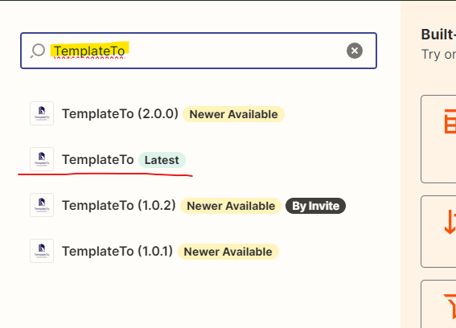
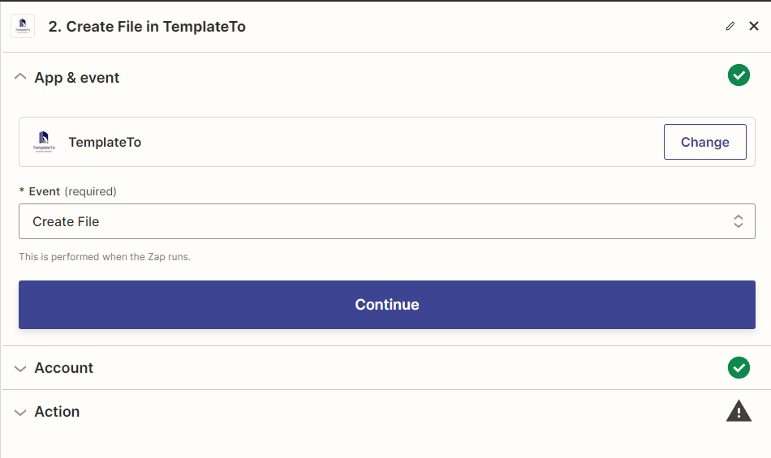
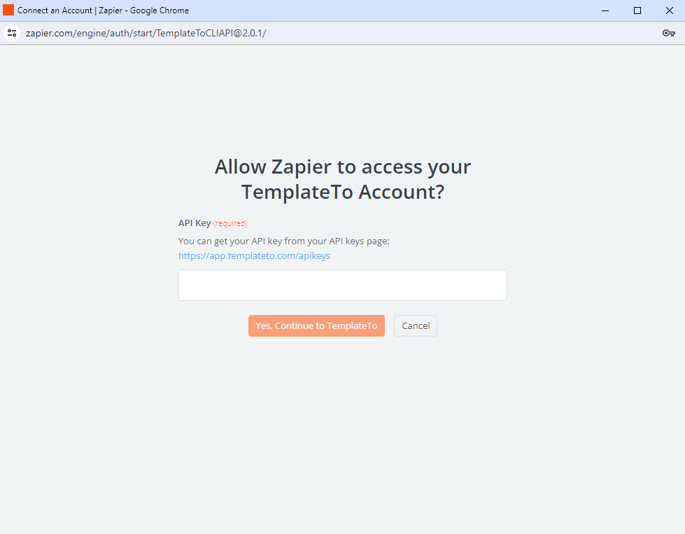
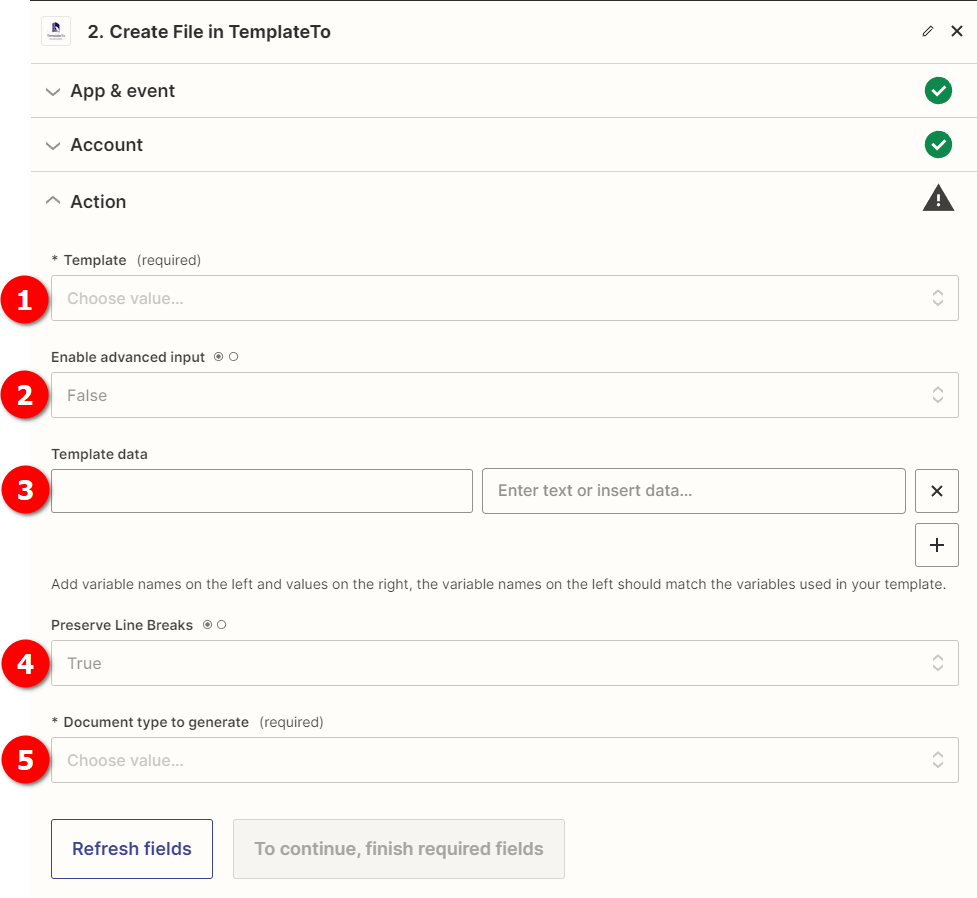
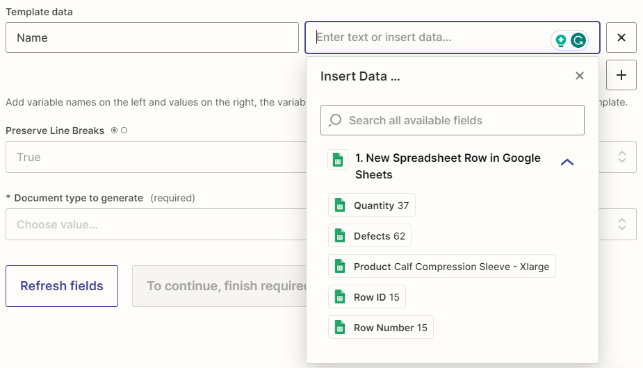
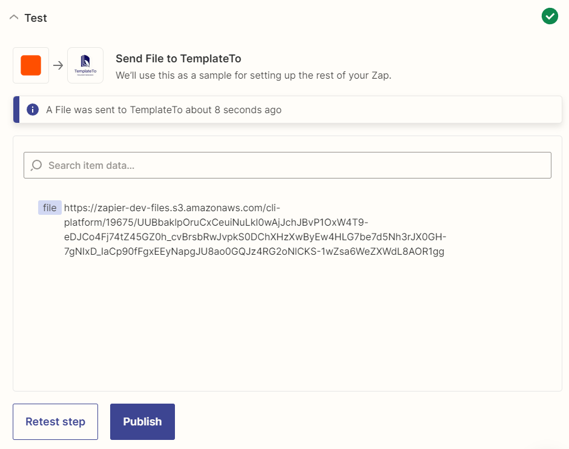

# Zapier

This guide expects you to have some experience with Zapier. 

## A trigger

In Zapier you will need to setup a trigger, this is an action that wil start your Zap. In our example we will use a google sheet.

## Configure TemplateTo

  

Type "TemplateTo" in the search and select the option marked with latest.

### App & event

  

In the event select "Create File", click Continue.

### Account

Create a connection, you will then get a pop-up, in the pop-up set your TemplateTo API key. 

!!! tip
    You can manage your api keys in the [admin here](https://app.templateto.com/generate/api-keys)

  

Click continue

### Action

Here we configure the template to be used and the data to be passed.

  

| Item                         | Description                                                                                                                                                                                                                                         |
| ---------------------------- | --------------------------------------------------------------------------------------------------------------------------------------------------------------------------------------------------------------------------------------------------- |
| 1. Template                  | Select your template from the dropdown list                                                                                                                                                                                                         |
| 2. Enable advanced input     | If you want to structure your own JSON then set to true, if you want to provide name value pairs, leave as false                                                                                                                                    |
| 3. Template data             | Either name value pairs or custom JSON depending on the previous option. If name value pairs you can select based on data available in your trigger.  |
| 4. Preserve Line Breaks      | If true will keep line breaks, also known as paragraph breaks from the input.                                                                                                                                                                       |
| 5. Document type to generate | Either PDF or Txt. |

Once all options are complete, click continue

### Test

Test that your integration is working correctly. 

Once the test has run you should be provided a link to your file like this

  

You can use this file in future steps, perhaps you want to send the file via an email or save the file to box or google drive, your options are vast.