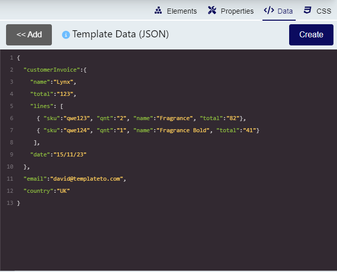
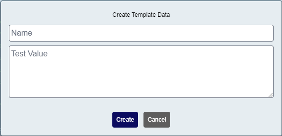
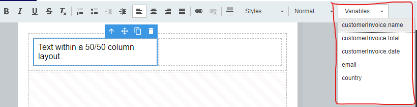
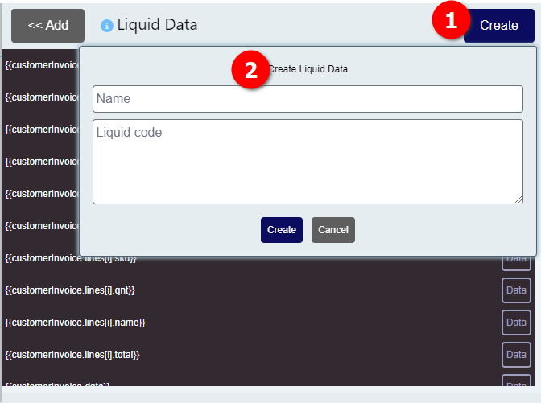

# Working with Variables

Variables let you create templates that generate personalized documents. Instead of hardcoding values, you use placeholders that get replaced with real data at render time.

## The Basics

Variables use double curly braces: `{{variableName}}`

When you render a template, you send JSON data. TemplateTo replaces each variable with the corresponding value from your data.

**Template:**
```html
Hello, {{name}}!
```

**Data:**
```json
{
  "name": "Alice"
}
```

**Result:**
```html
Hello, Alice!
```

## Adding Test Data

In the template editor, paste your JSON into the **Template Data** panel to test your template.



??? example "Sample JSON Data"
    ```json
    {
      "customerInvoice": {
        "name": "Lynx",
        "total": "123",
        "lines": [
          { "sku": "qwe123", "qnt": "2", "name": "Fragrance", "total": "82" },
          { "sku": "qwe124", "qnt": "1", "name": "Fragrance Bold", "total": "41" }
        ],
        "date": "15/11/23"
      },
      "email": "david@templateto.com",
      "country": "UK"
    }
    ```

For simple key-value data, use the **Create** button to add variables without writing JSON manually.



## Using Variables in Templates

### From the Editor

Use the variable dropdown to insert variables without typing:



### By Typing

Type the variable name directly in your HTML:

```html
<p>Customer: {{customerInvoice.name}}</p>
<p>Email: {{email}}</p>
```

## Accessing Nested Data

Use dot notation to access nested properties:

```html
<!-- Access nested object properties -->
{{customerInvoice.name}}
{{customerInvoice.total}}
{{customerInvoice.date}}
```

For more complex data access patterns including arrays, see [Data Binding](data-binding.md).

## Liquid Templating

TemplateTo uses the [Liquid](https://shopify.github.io/liquid/) templating engine. This gives you:

- **Variables**: `{{variable}}`
- **Logic**: `...`
- **Loops**: `...`
- **Filters**: `{{value | filter}}`

See [Liquid Reference](liquid-reference.md) for complete syntax documentation.

## Computed Variables

For complex transformations, create **Liquid Variables** in the editor:



1. Navigate to the **Data** tab in the editor
2. Give your variable a name
3. Write your Liquid expression

!!! warning "Variable Order"
    If one variable uses another, define the dependency first. Variables are processed in order.

**Example:** Create a computed variable called `formattedDate`:
```liquid
{{ customerInvoice.date | parse_date | date: "%e %B %Y" }}
```

Then use it in your template:
```html
<p>Invoice Date: {{formattedDate}}</p>
```

## Next Steps

- [Data Binding](data-binding.md) - Learn about arrays, nested access, and JSON patterns
- [Filters & Tags](filters-tags.md) - Format dates, numbers, and more
- [Liquid Reference](liquid-reference.md) - Complete Liquid syntax guide
