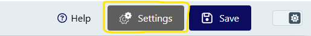
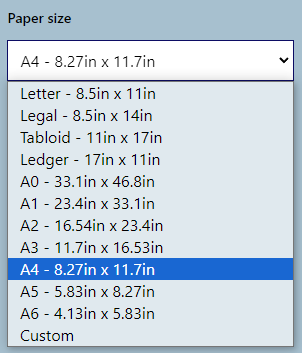
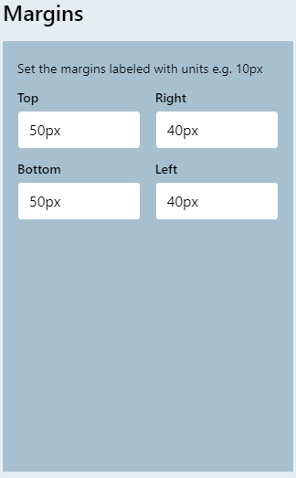
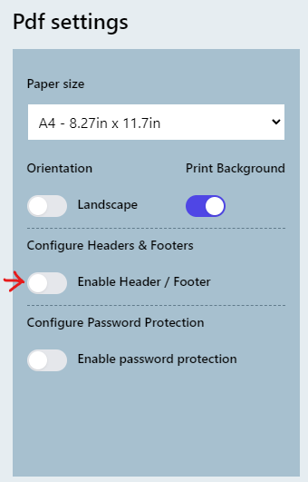
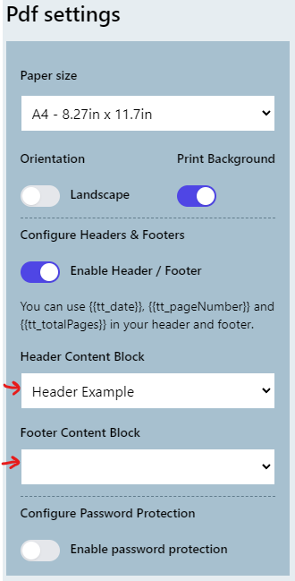
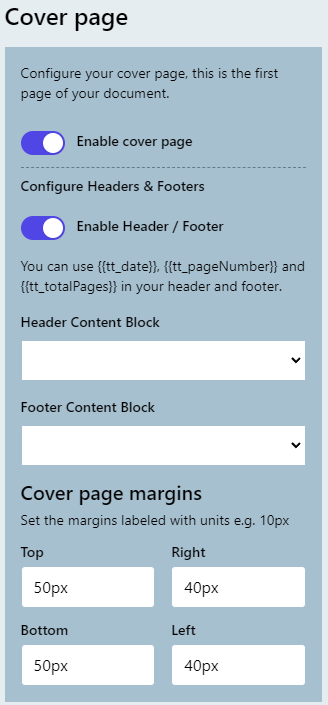
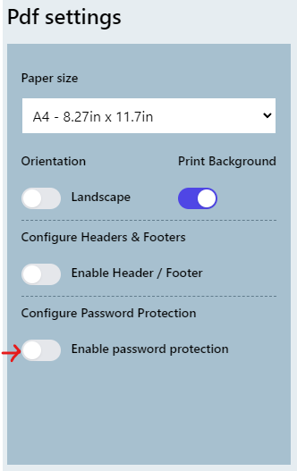
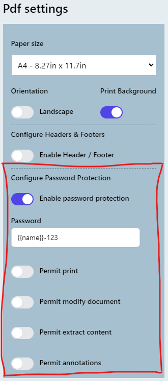
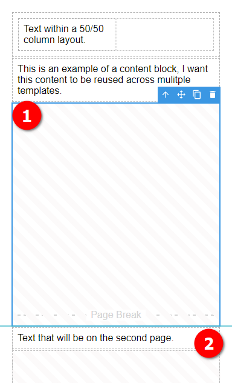

# PDF Generation

TemplateTo generates high-quality PDF documents from your templates. This guide covers PDF-specific settings and features.

## Overview

PDF output is ideal for:

- Printable documents (invoices, contracts, reports)
- Multi-page content with page breaks
- Documents requiring headers and footers
- Password-protected files
- Official documents requiring consistent formatting

## PDF Settings

Access PDF settings through the Template Settings panel in the editor.



### Paper Size

Choose from standard sizes or define custom dimensions:



**Standard sizes:**

- A4 (210mm x 297mm) - Default
- Letter (8.5" x 11")
- Legal (8.5" x 14")
- A3, A5, and more

**Custom size:** Select "Custom" and enter dimensions in millimeters.

### Orientation

- **Portrait** (default) - Taller than wide
- **Landscape** - Wider than tall

### Print Background

Enable to include background colors and images in the PDF. This is enabled by default.

### Margins



Set margins for top, bottom, left, and right edges.

!!! note
    Headers and footers render within the margins. Ensure adequate margin space when using headers/footers.

## Headers and Footers

Add consistent headers and footers to every page of your document.

### Enabling Headers/Footers

1. Open Template Settings
2. Toggle "Display Header / Footer"
3. Select content blocks for header and/or footer



### Using Content Blocks

Headers and footers use [Content Blocks](../creating/elements.md#content-blocks) - reusable pieces of content you can share across templates.



Create content blocks at: [Content Block Manager](https://app.templateto.com/templates/blocks)

### Page Numbers

Use Liquid variables in your header/footer content blocks:

- `{{page}}` - Current page number
- `{{pages}}` - Total page count

Example footer: `Page {{page}} of {{pages}}`

## Cover Page

Apply different settings to the first page of your document.



Cover page options let you:

- Use different margins for page 1
- Hide headers/footers on the cover
- Apply different orientation

## Password Protection

Secure your PDFs with password protection and permission controls.

### Enabling Protection

1. Open Template Settings
2. Toggle "Password Protection"
3. Configure options



### Protection Options



| Option | Description |
|--------|-------------|
| Password | Password to open the document. Supports variables like `{{customerPassword}}` |
| Permit Print | Allow printing |
| Permit Modify | Allow editing document content |
| Permit Extract | Allow copying text and images |
| Permit Annotations | Allow adding comments and annotations |

!!! tip "Dynamic Passwords"
    The password field accepts template variables. Use `{{password}}` and pass a unique password in your API request for per-document encryption.

## Page Breaks

Control where new pages begin in your document.

### Page Break Element

Add a Page Break element to force content onto a new page:



1. The Page Break element fills remaining space on the current page
2. Content after the break appears on the next page

### Automatic Page Breaks

TemplateTo calculates estimated page breaks automatically. The editor shows dotted lines indicating where breaks will occur.

To disable this calculation (useful for templates with complex layouts), toggle "Disable PageBreak Calculation" in Template Settings.

## API Integration

### Generate PDF from Template

```bash
curl -X POST "https://api.templateto.com/render/pdf/{templateId}" \
  -H "X-Api-Key: your-api-key" \
  -H "Content-Type: application/json" \
  -d '{"customerName": "Acme Corp", "total": 150.00}'
```

### Generate PDF from Raw HTML

```bash
curl -X POST "https://api.templateto.com/render/pdf/fromhtml" \
  -H "X-Api-Key: your-api-key" \
  -H "Content-Type: application/json" \
  -d '{"base64HtmlString": "PGh0bWw+PGJvZHk+SGVsbG8gV29ybGQ8L2JvZHk+PC9odG1sPg=="}'
```

!!! tip "Base64 Encoding"
    Raw HTML must be Base64 encoded. In JavaScript: `btoa(htmlString)`. In Python: `base64.b64encode(html_string.encode()).decode()`.

### Response Types

- **File download** - `POST /render/pdf/{templateId}` returns the PDF directly
- **Base64 encoded** - `POST /render/pdf/{templateId}/as-byte-array` returns a Base64 string

For complete API documentation, see the [REST API Reference](../../developer-guide/rest-api.md).

## Best Practices

1. **Test with realistic data** - Use actual content lengths to verify page breaks
2. **Set appropriate margins** - Leave room for headers/footers and binding
3. **Use content blocks** - Share headers/footers across related templates
4. **Consider print settings** - Enable "Print Background" if you use background colors
5. **Validate passwords** - Test password-protected PDFs open correctly
